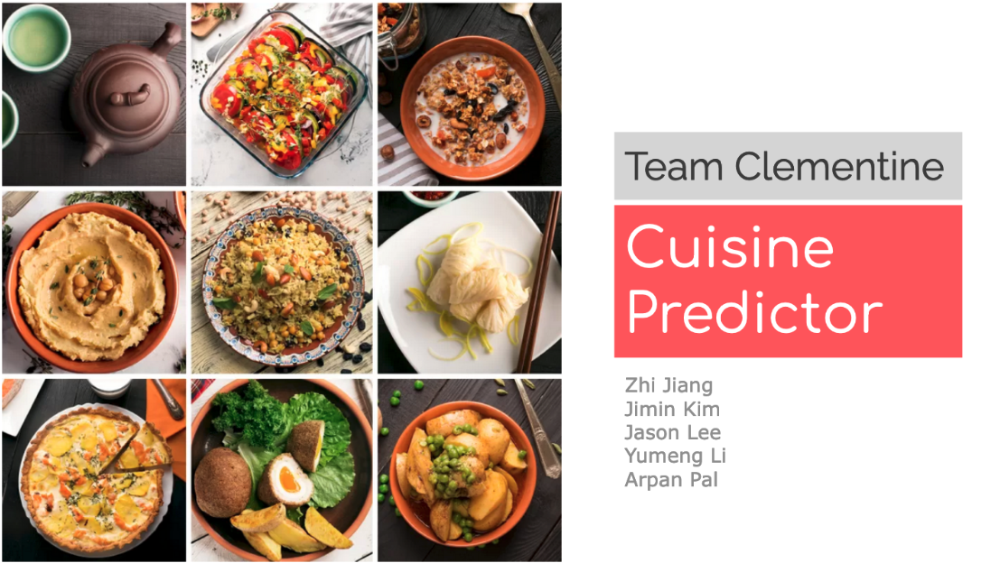

# Clementine-cuisine-prediction-project

  

This is our shared repository for the cuisine prediction project

Cuisines vary significantly across the countries. One of the key characteristics that distinguish different types of cuisines is the ingredients used in each dish. The goal of the project is to identify cuisine origin using only the ingredients. Accurately associating ingredients to cuisines will be a valuable tool to better understand the characteristics of each type of cuisine as well as creating an algorithm that can recommend recipes using different combinations of raw ingredients.

## Table of contents

## Project Limitations

## Slides

