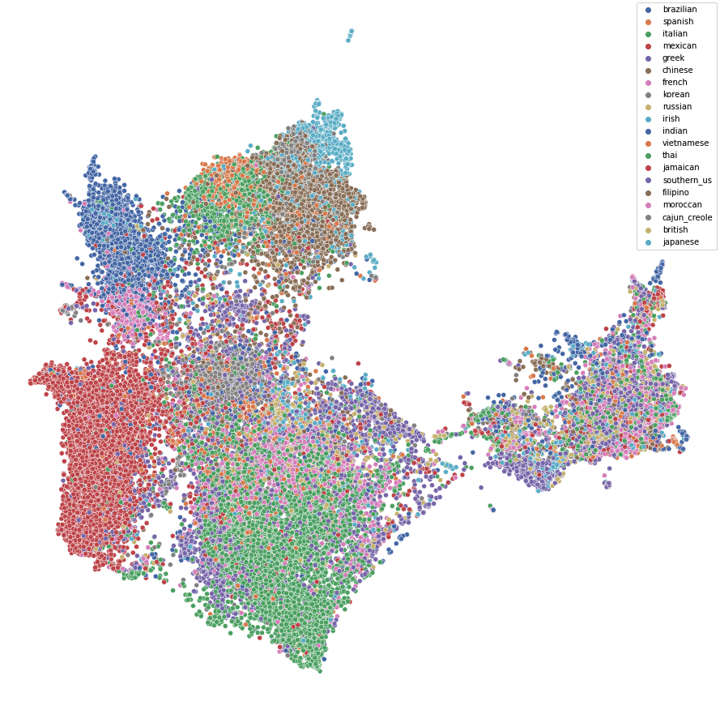

# Team Clementine: cuisine-prediction-project

This is our shared repository for the cuisine prediction project.

  

Cuisines vary significantly across the countries. One of the key characteristics that distinguish different types of cuisines is the ingredients used in each dish. The goal of the project is to identify cuisine origin using only the ingredients. Accurately associating ingredients to cuisines will be a valuable tool to better understand the characteristics of each type of cuisine as well as creating an algorithm that can recommend recipes using different combinations of raw ingredients.

## Table of contents

  - [Process](#process)
  - [Results](#results)
  - [Value](#value)
  - [Future Work](#future-work)
  - [Slides](#slides)

## Process

1. Uniformization. Refine the texts in the set of ingredients. Make them lowercase and reduce redundant empty space.

2. Embedding and Dimension Reduction. We lower the dimensionality of the ingredients from 7,000 unique values to 300 dimensions. We utilize the Word2Vec algorithm that uses a neural network model to achieve this goal. Alternatively, we also try principal component analysis (PCA) from the one-hot encoding of the data.

3. Classifying Models. We use vectorized data to train our model. We explore multiple machine learning models: Neural network, Support Vector Machine, Random Forest, and XGBoost.

## Results

Add the Accuaracy Table. 

      
  </a>

## Value

Identifying cuisines using raw ingredients will be valuable to companies that build recipe databases. Easier categorization, and creating a recommendation tool for the users. Word2Vec can still vectorize a new ingredient that is never seen in the training set. 

## Future Work

- We can explore and fill in the numbers in the “Performance by Accuracy” table above.
- Expand data by adding other features like the amount of ingredients, cooking time, or images of ingredients.
- Decision Tree can suggest the significance of the ingredients.

## Slides

Additional information can be found in our presentation slides at https://docs.google.com/presentation/d/1rQVuPna01ftV61t4Rf2TF07l0IDETDBjaMrvKBboQlw/edit?usp=sharing